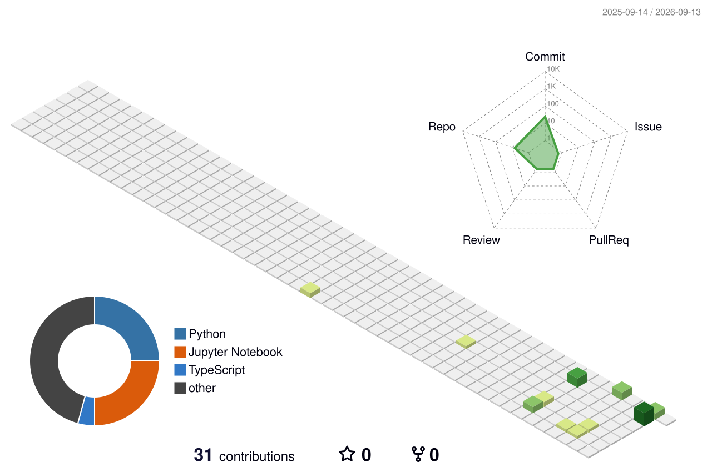

<div align="center">

# 👋 Hi, I'm Srishti Kumari


<br>


</div>

---

# 👩‍💻 ABOUT ME

🎓 **Data Science Student** passionate about Artificial Intelligence, Machine Learning and Data Science.

💻 I enjoy building practical projects using **Python, Machine Learning, Data Analysis and Generative AI**.

🤖 Currently improving my skills in:

- Generative AI
- Large Language Models
- RAG
- LangChain
- AI Agents
- Machine Learning
- Deep Learning
- Data Analysis
- SQL

📊 I love turning data into meaningful insights and building applications that solve real-world problems.

🚀 My goal is to become an **AI/ML & Data Science professional** and build impactful AI-powered applications.

---

# 🔗 CONNECT WITH ME

<div align="center">

<a href="https://www.linkedin.com/in/srishti-kumari-5285b8251/">

</a>

<a href="mailto:YOUR_EMAIL@gmail.com">

</a>

<a href="https://github.com/srishtikumari-0706">

</a>

</div>

---

# 🔥 MY GITHUB STREAK

<div align="center">


</div>

<br>

<div align="center">

### 🔥 CONSISTENCY • 📈 PROGRESS • 🚀 LEARNING

</div>

---

# 📊 MY GITHUB ACTIVITY

<div align="center">


</div>

---

# 🟢 MY CONTRIBUTION JOURNEY

<div align="center">



</div>

---

# 🛠️ TECH STACK

<div align="center">

### 👩‍💻 Programming


### 📊 Data Science


### 🤖 AI / Machine Learning


### 🗄️ Databases


### 🌐 Development


### ☁️ Tools & Cloud


</div>

---

# 🚀 FEATURED PROJECTS

## 💰 Crypto Portfolio Optimizer

A data-driven cryptocurrency portfolio optimization application that uses historical market data and backtesting to identify effective asset allocations while focusing on reducing portfolio drawdowns.

**Technologies:**

`Python` `Pandas` `NumPy` `Machine Learning` `Streamlit`

<div align="center">

<a href="https://crypto-portfolio-optimizer-lm2llwv8ntkmzh8wi5yavj.streamlit.app/">


</a>

</div>

---

## 🎬 AI Video Animator

An AI-powered application focused on transforming and enhancing video content using modern Artificial Intelligence techniques.

**Technologies:**

`Python` `AI` `Machine Learning` `Generative AI`

<div align="center">

<a href="https://ai-video-animator-ajmm07ghs-srishti-kumaris-projects-304c4b77.vercel.app/">


</a>

</div>

---

## 🛡️ Transaction Fraud Detection

A Data Science and Machine Learning project focused on predicting whether a financial transaction is fraudulent or legitimate.

**Technologies:**

`Python` `Pandas` `NumPy` `Scikit-Learn` `Machine Learning`

**Status:** 🚧 Work in Progress

---

# 🧠 CURRENTLY LEARNING

<div align="center">


</div>

---

# 📈 MY LEARNING JOURNEY

<div align="center">

```text
Data Science
      ↓
Python & Data Analysis
      ↓
Machine Learning
      ↓
Deep Learning
      ↓
Generative AI
      ↓
LLMs + RAG
      ↓
AI Agents
      ↓
Production AI Applications 🚀
